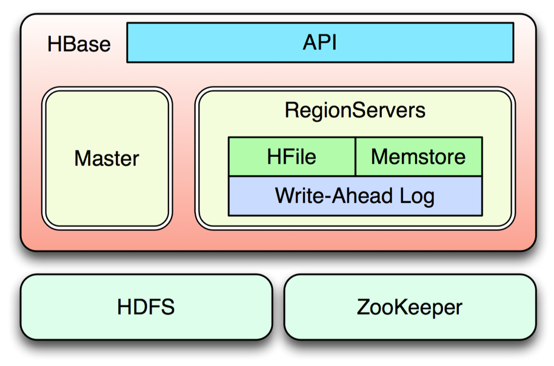
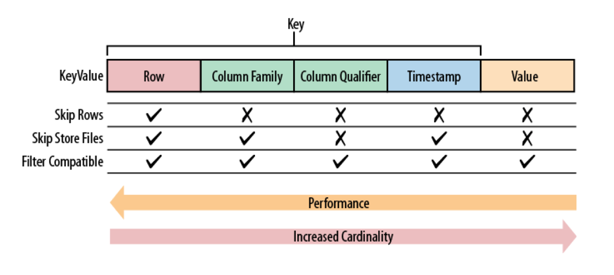
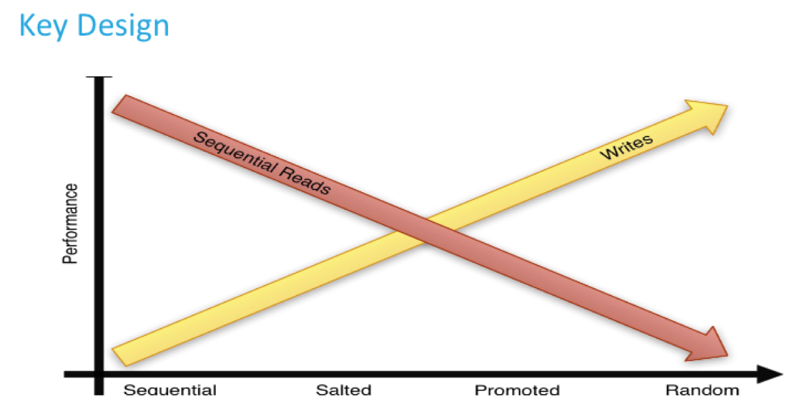

# Day 4: HBase

HBase is the NoSQL database for Hadoop. A few notes:

<li>HBase is composed of one Master and many Slave servers (aka Region Servers)</li>
<li>Clients mostly communicate with slaves</li>
<li>Slaves store actual data</li>
<li>The HBase MemStore is used for accruing data and changes</li>
<li>HFiles are used for persistence</li>
<li>Write-Ahead-Log (WAL) is used for fail-safety</li>
<li>HDFS is used as the backing store</li>

 HBase Table Concepts

<li>Tables are sorted by the Row Key in lexicographical order</li>
<li>The table schema only defines its column families</li>
<li>Each family consists of any number of columns</li>
<li>Each column consists of any number of versions</li>
<li>Columns only exist when inserted, NULLs are free</li>
<li>Columns within a family are sorted and stored together</li>
<li>Everything except table names are byte[]</li>
<li>To find a value you will need: Table, Row Key, Family:Column, Timestamp (optional)</li>

 HBase Column Family and Column Concepts

<li>Column families are created during table creation</li>
<li>Use only a few column families</li>
<li>Arbitrary columns per column family are created at runtime</li>
<li>Group related columns (accessed together) in same column family</li>

 HBase Key design: please read <a href="http://archive.cloudera.com/cdh5/cdh/5/hbase-0.98.6-cdh5.3.8/book/rowkey.design.html">here</a> to learn about row key design in HBase

 HBase Architecture

 HBase Value Retrieval

 HBase Access Patterns

 For more information please see <a href="https://hbase.apache.org/">here</a>

<b>Exercise:</b>

You run a number of websites served by the following domains:

<li>www.apples.com</li>
<li>www.gourmet.net</li>
<li>www.salsas.org</li>
<li>www.kitchen.tv</li>
<li>www.random.gob</li>

 Upon visiting any of these domains, visitors must authenticate by providing their email address (the conventional form <username>@<mail.provider.domain> such as joe@gmail.com); also the IP address from which the user is visiting is available. Design an HBase schema (one or more) that will allow you to perform the following and provide an explanation for each:

<li>Store (Put) and Query (Get) how many visitors a particular domain had during a given timeframe</li>
<li>Store (Put) and Query (Get) which domains a particular user visited and from which IP address during a given timeframe</li> 

 Publish your typed answer <a href="answer.txt">here</a>.